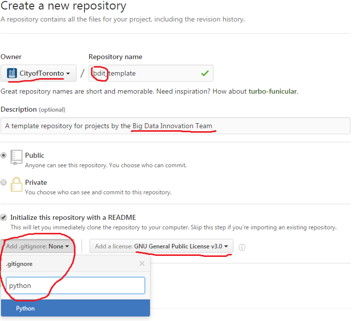
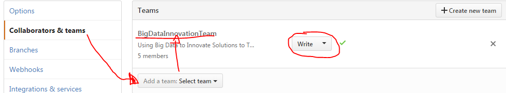

# Template Repository
*A template repository for projects by the Big Data Innovation Team*

## Table of Contents
1. [Purpose](#purpose)
2. [How to use](#how-to-use)
   * [Create a New Repository](#create-a-new-repository)
   * [Use Issues](#use-issues-to-manage-tasks)
   * [Create a Project Board](#create-a-project-board)
3. [How to contribute](#how-to-contribute)  

## 1. Purpose
We wanted to provide some guidelines on what Big Data Innovation Team code repositories should contain and how they should be structured. This section should contain the goal(s) of the project and a roadmap of how they will or have been achieved. 

## 2. How to use
This section would typically explain how someone can use the information in the repository for their own purposes. If the project features atomic submodules (like the [data sources repository](https://github.com/CityofToronto/bdit_data-sources)), this section should give a higher-level overview of the purpose of each folder within the repository and then each subfolder should have its own README that would also be in this style. The [most specific README](sub_task1/README.md) should include information about the different languages used and external dependencies, if any, and how to acquire them. 

###  2.1 Create a New Repository

You can use the contents of this README and repository as a guide when [creating your own repository](https://github.com/new). You'll be confronted with the image below, read on to find out what's important.

**Owner** should be the CityofToronto organization.  
**Repository name** should start with `bdit`, so we can differentiate from projects from other teams within the City  
**Description** should include the name of our team: Big Data Innovation Team

**`.gitignore`** tells git to ignore all kinds of files that don't need to be tracked, or don't need to be published. You can select from a template in the drop-down here. Since many of our projects might involve multiple languages, track down extra `.gitignore` templates [here](https://github.com/github/gitignore) and copy and paste their contents into the main `.gitignore` file.

#### After Creating the Repository
Before starting to write code in the repository there are a few other things you should do.

##### Add Big Data Innovation Team as a Team
Click on the  button in the top right and go to **Collaborators & Teams**.

Search for **BigDataInnovationTeam** in the drop down menu and add us. Give us **Write** permission so anyone in our team can write directly to the repository.

##### Add the Repository to Slack
Any activity in the repository (commits, issue creation, comments on issues) will be posted to our Slack. Go to https://bditto.slack.com/apps/ then Github > Add Configuration. Choose the channel relevant to the project and then add the repository you just created. Keep the rest of the defaults and click Save Integration at the bottom.

##### Fill out the README!

The README at the root of your new repository should have the same 3 top level headings as this repository. Write out the purpose of the project and a roadmap of how to get there. 

###  2.2 Use Issues to Manage Tasks
>Issues are a great way to keep track of tasks, enhancements, and bugs for your projects. They’re kind of like email—except they can be shared and discussed with the rest of your team. Most software projects have a bug tracker of some kind. GitHub’s tracker is called Issues, and has its own section in every repository.

Issues are a great way to manage tasks in a project. Have a full read of their power on Github [here](https://guides.github.com/features/issues/). It's very easy to link commits to issues by using the `#` in GitHub Desktop, that way your history of commits can be matched by a history of comments in Issues. Also, if the repository contains sub-tasks, you should create milestones for each to more easily track issues relating to specific tasks. 

ALSO! If you go to [Issues](https://github.com/issues) at the very top of any GitHub page you will go to your own personal issue tracking page. There you can filter by issues that have been [assigned](https://github.com/issues/assigned) to you or where you've been [mentioned](https://github.com/issues/mentioned) as well as filter by Organization and sort by date, comments, :heart:. 

###  2.3 Create a Project Board
Because the issue page might be a little linear and clunky, GitHub adopted a [kanban](https://en.wikipedia.org/wiki/Kanban) style project board.

It's a pretty neat way to visualize and manage tasks so have a read up on how to use one [here](https://help.github.com/articles/tracking-the-progress-of-your-work-with-projects/)

## 3. How to contribute

We welcome the opportunity to collaborate with the public and other agencies! A good first step would be to open an issue with the [ label](https://github.com/CityofToronto/bdit_template/labels/question) requesting more information about the project. 

Internally, as our projects become more complex, we may have better ideas of best practices for organizing info. Feel free to raise issues, submit pull requests, or edit this repository directly. Maybe someday create a [`CONTRIBUTING.md` template file](https://help.github.com/articles/setting-guidelines-for-repository-contributors/) ([see issue](https://github.com/CityofToronto/bdit_template/issues/2))
